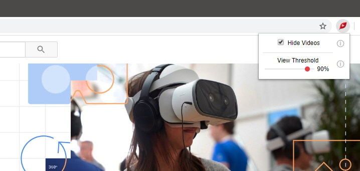

<h1>
   FreshView for YouTube™
</h1>

FreshView for YouTube™ is a [Chrome](https://chrome.google.com/webstore/detail/freshview-for-youtube/eckknmnfoohbeklmjlidmfdlakndcfkm) and [Firefox](https://addons.mozilla.org/en-US/firefox/addon/freshview-for-youtube/) extension that hides YouTube™ videos which users have already watched.

---

#### Repository Layout

The contents of the top-level directories match their names exactly:

| **Directory**    | **Contents**     |
| :--------        | :--------        |
| [assets](assets) | Asset files      |
| [css](css)       | CSS files        |
| [html](html)     | HTML files       |
| [img](img)       | Icon files       |
| [js](js)         | JavaScript files |

The [js](js) directory contains the following scripts:

| **File**                          | **Purpose**                                            |
| :---                              | :---                                                   |
| [album.js](js/album.js)           | Implements a container for Videos.                     |
| [background.js](js/background.js) | Activates the extension in the browser toolbar.         |
| [injection.js](js/injection.js)   | Attaches listeners to browser storage events.           |
| [logger.js](js/logger.js)         | Wraps `console` to control the visibility of messages. |
| [manager.js](js/manager.js)       | Finds and manages Videos on a page.                    |
| [popup.js](js/popup.js)           | Attaches listeners to the extension UI.                |
| [video.js](js/video.js)           | Implements a model for YouTube™ videos.                |

#### How it Works

When the DOM is mutated, FreshView polls the DOM for HTML elements that match the expected structure of a YouTube™ video.  Each HTML element that matches the structure of a YouTube™ video is converted into a `Video` object.  All Videos with a view progress that meets or exceeds the current view threshold are added to a dynamic collection of Videos known as an `Album`.  When a Video is added to an Album, it is displayed or hidden depending on the state of the UI checkbox.  Similarly, when a Video is removed from an Album, it is reverted to a visible state.

##### Technical Notes
1. The visibility of a Video is controlled by setting the `display` attribute of a YouTube™ video element's `style`.
1. The view progress of a Video is derived from the red bar shown along the bottom of a YouTube™ video element.
1. Only DOM `childList` mutations trigger a poll request.
1. DOM mutations that occur within 200 milliseconds of one another are batched into a single poll request.
1. The view threshold slider is only synced on `mouseup` events to avoid exceeding the `storage.sync` quota.
1. YouTube™ videos that appear in the Autoplay panel or the History tab are ignored.

### Screenshots

#### User Interface

#### Watch Progress

